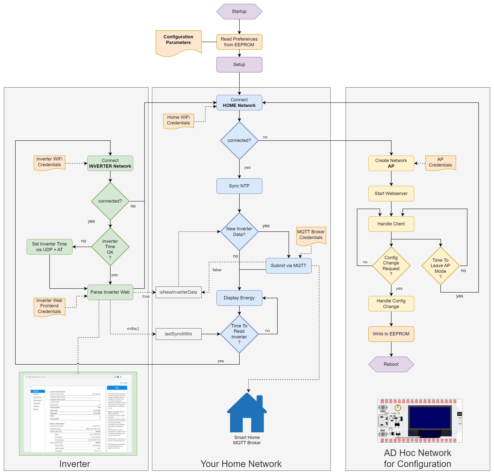

> [!NOTE]
> Here I documented some code parts with explanaitions to be able to better understand and extend the project. Keep in mind that some translations have been performed with ChatGPT. So I hope everything is making sense at the end - Please checkout the real code for a working set. 

## Table of Contents
- [SPIDR.ino - Main Program](#spidrino---main-program)
  - [setup Function](#setup-function)
  - [loop Function](#loop-function)
  - [Statemachine](#statemachine)
  - [setupTime](#setuptime)
  - [loadPreferencesIntoVariables](#loadpreferencesintovariables)
  - [activateAPMode - Start AccessPoint Mode](#activateapmode---start-accesspoint-mode)
  - [deactivateAPMode - Stop AccessPoint Mode](#deactivateapmode---stop-accesspoint-mode)
  - [Screenscraping - Reading the Data from the Inverter's HTML page](#screenscraping---reading-the-data-from-the-inverters-html-page)
  - [Statemachine Inverter Mode - handleInverterNetworkMode](#statemachine-inverter-mode---handleinverternetworkmode)
  - [Statemachine Home Network Mode - handleHomeNetworkMode](#statemachine-home-network-mode---handlehomenetworkmode)
  - [Statemachine Accesspoint Mode - handleAPMode](#statemachine-accesspoint-mode---handleapmode)
- [Display Manager](#display-manager)
  - [u8g2 Library Functions](#u8g2-library-functions)
    - [Set Font](#set-font)
    - [Draw String](#draw-string)
    - [Get String Width](#get-string-width)
    - [Clear Buffer](#clear-buffer)
    - [Send Buffer](#send-buffer)
  - [Display Manager Constructor Explanation](#display-manager-constructor-explanation)
  - [Action Display](#action-display)
  - [Invoking the Display Action Method](#invoking-the-display-action-method)
  - [DisplayManager::drawBigNumberNoHeader Method](#displaymanagerdrawbignumbernoheader-method)
- [Inverter Class Documentation](#inverter-class-documentation)
  - [printVariables](#printvariables)
  - [updateData](#updatedata)
  - [getInverterPowerNow_W](#getinverterpowernoww)
  - [extractVariables](#extractvariables)
  - [extractValue and extractFloatValue](#extractvalue-and-extractfloatvalue)
- [MQTTManager Class Documentation](#mqttmanager-class-documentation)
  - [Constructor](#constructor)
  - [Methods](#methods)
    - [publish](#publish)
    - [publishAllData](#publishalldata)
  - [Home Assistant Autodiscovery Configurations](#home-assistant-autodiscovery-configurations)


# SPIDR.ino - Main Program
To understand the main Flow of SPIDR, you shopuld try to understand the following Flowchart. It might not be perfectly in line with the code, but fully explains the general idea. 



## setup Function
```cpp
void setup() {
    Serial.begin(115200); // Starts the serial connection
    delay(500); // Short pause
    prefsManager.begin(); // Initializes the settings manager
    loadPreferencesIntoVariables(); // Loads settings into variables
    displayManager.init(); // Initializes the display with a start screen
    action.name = "S|P|I|D|R"; // Sets the action name
    displayManager.displayAction(action); // Displays the action on the display
    setupTime(); // Initializes the time
    mqttManager = new MQTTManager(MQTT_BROKER_HOST.c_str(), MQTT_BROKER_PORT,
        MQTT_BROKER_USER.c_str(), MQTT_BROKER_PWD.c_str(), displayManager, 
        inverter, serialCapture); // Initializes the MQTT Manager
    currentState = HOME_NETWORK_MODE; // Sets the current state
    inverter.initializeDataBuffer(0); // Initializes the inverter data buffer
}
```
## loop Function
```cpp
void loop() {
    static unsigned long lastSetupTimeCalled = 0; // Stores when setupTime was last called
    const unsigned long intervalSetupTime = 120000; // Interval for setupTime in milliseconds (2 minutes)
    static unsigned long lastStatemachineCalled = 0; // Stores when the state machine was last called
    const unsigned long intervalStatemachine = 200; // Interval for the state machine in milliseconds
    if (millis() - lastStatemachineCalled >= intervalStatemachine) {
        updateStateMachine(); // Updates the state machine
        lastStatemachineCalled = millis(); // Updates the time of the last call
    }
    if (millis() - lastSetupTimeCalled >= intervalSetupTime) {
        setupTime(); // Updates the time
        lastSetupTimeCalled = millis(); // Updates the time of the last call
    }
    delay(5); // Short delay to slow down the loop
}

```
## Statemachine
```cpp
void updateStateMachine() {
    switch (currentState) {
        case INVERTER_NETWORK_MODE: // Handles the inverter network mode
            handleInverterNetworkMode();
            break;
        case HOME_NETWORK_MODE: // Handles the home network mode
            handleHomeNetworkMode();
            break;
        case AP_MODE: // Handles the access point mode
            handleAPMode();
            break;
    }
}
```
## setupTime
```cpp
void setupTime() {
    // Uses NTP time or, if unavailable, the build time
    // ...
}

```
## loadPreferencesIntoVariables
```cpp

void loadPreferencesIntoVariables() {
    // Loads parameters and writes them to local variables
    // ...
}

void wifi_connect(String ssid, String passkey, String comment) {
    // Disconnects Wi-Fi to prevent errors
    WiFi.disconnect(true);
    delay(500);
    WiFi.mode(WIFI_AP_STA); // Sets the station mode
    // ...
    // For the inverter Wi-Fi, the IP is manually set to avoid disturbing the Wi-Fi relay
    if (ssid == WIFI_INVERTER_SSID) {
        IPAddress staticIP(10, 10, 100, 149);
        IPAddress gateway(10, 10, 100, 254);
        IPAddress subnet(255, 255, 255, 0);
        IPAddress dns(8, 8, 8, 8); // Not needed
        WiFi.config(staticIP, gateway, subnet, dns);
    } else {
        // Use DHCP for other networks
        WiFi.config(INADDR_NONE, INADDR_NONE, INADDR_NONE, INADDR_NONE);
    }
    // Establishes connection to the network
    WiFi.begin(ssid.c_str(), passkey.c_str());
    // ... Error handling and attempts ...
}

```
## activateAPMode - Start AccessPoint Mode 
```cpp

void activateAPMode() {
    WiFi.mode(WIFI_AP); // Enables AP+STA mode for simultaneous access point and Wi-Fi client mode
    WiFi.softAP(WIFI_AP_NAME, WIFI_AP_PASSWORD);
    webServerManager.begin();
}

```
## deactivateAPMode - Stop AccessPoint Mode 
```cpp

void deactivateAPMode() {
    WiFi.mode(WIFI_STA);
    webServerManager.stop();
}
```

## Screenscraping - Reading the Data from the Inverter's HTML page

```cpp
bool readInverterDataFromWebInterface(String url, String web_user, String web_password) {
    String serverIp = WiFi.gatewayIP().toString(); // Converts the gateway IP to a string
    String website = "http://" + serverIp + "/" + url; // Creates the URL for the webpage
    bool readHTML = false; // Initializes the variable that indicates whether HTML was read
    WiFiClient client; // Creates a WiFiClient object

    if (client.connect(serverIp.c_str(), 80)) { // Connects to the server over port 80
        // Creates the value for HTTP Basic Authentication
        String authHeaderValue = "Basic " + base64::encode(web_user + ":" + web_password);
        client.println("GET /" + url + " HTTP/1.1"); // Sends the HTTP GET Request
        client.println("Host: " + serverIp); // Sends the Host header
        client.println("Authorization: " + authHeaderValue); // Sends the Authorization header
        client.println("Connection: close"); // Requests that the connection be closed after the response
        client.println(); // Ends the HTTP header
        String response = ""; // Initializes the response string
        String line = ""; // Initializes the line string
        while (client.connected()) { // As long as the client is connected
            while (client.available()) { // As long as data from the server is available
                char c = client.read(); // Reads the next character
                if (c == '\n') { // If the character is a newline
                    if (line.indexOf("<H4>401 Unauthorized</H4>") > 0) { // Checks for a 401 Unauthorized response
                        readHTML = false; // Sets readHTML to false
                        return readHTML; // Ends the function early
                    }
                    // Checks if the line starts with a relevant variable
                    if (line.startsWith("var webdata") || line.startsWith("var cover") || line.startsWith("var status")) {
                        line.replace("var ", ""); // Removes "var " from the start of the line
                        response += line + "\n"; // Adds the line to the response
                    }
                    line = ""; // Resets the line
                } else if (c != '\r') { // If the character is not a carriage return
                    line += c; // Adds the character to the line
                }
            }
        }
        ParseStatus result = inverter.updateData(response); // Parses and updates the data
        client.stop(); // Stops the connection to the server
    } else {
        // Logic could be added here to handle failed connections
        // No connection possible
    }
    return readHTML; // Returns whether the HTML was successfully read
}

```

## Statemachine Inverter Mode - handleInverterNetworkMode

```cpp
void handleInverterNetworkMode() {
    // Check if the connection to the inverter network was successful
    if (connectedToInverterNetwork && (WiFi.status() == WL_CONNECTED)) {
        // Establish a UDP connection to set the correct time
        bool udpConnectionCreated = inverterUdp.inverter_connect(WiFi.gatewayIP().toString(), udpServerPort, udpLocalPort, udpTimeout_s);
        if (udpConnectionCreated) {
            String response = inverterUdp.inverter_readtime(); // Reads the time from the inverter
            if (inverterUdp.isDefaultTimeSet()) { // Checks if the standard time is set and adjusts if necessary
                response = inverterUdp.inverter_settime(getCurrentEpochTime()); // Sets the current time
                String response_new = inverterUdp.inverter_readtime(); // Reads the newly set time
            }
            inverterUdp.inverter_close(); // Closes the UDP session
        } else {
            // No UDP connection possible
            // ...
        }
        // Read and parse data from the inverter's HTML page
        bool readHTML = readInverterDataFromWebInterface(status_page_url, INVERTER_WEBACCESS_USER, INVERTER_WEBACCESS_PWD);
        if (readHTML) {
            newInverterDataAvailable = true; // New data is available
            lastInverterUpdateMillis = millis();
        }
        inverter.printVariables(); // Outputs the inverter status on the Serial Monitor
    } else {
        if ((millis() - lastInverterUpdateMillis > INVERTER_OFFLINE_TIMEOUT_SECONDS * 1000)) {
            inverter.setInactiveValues(); // Sets inactive values if the inverter is not reachable
            newInverterDataAvailable = true; // Indicates that new data is available
        }

        if (hour() == 0 && inverter.getInverterEnergyToday_kWh() > 0.0) {
            inverter.resetEnergyTodayCounter(); // Resets the daily counter at midnight
            newInverterDataAvailable = true; // Indicates that new data is available
        }
    }
    currentState = HOME_NETWORK_MODE; // Switches back to the home network mode
    wifi_connect(WIFI_HOME_SSID, WIFI_HOME_KEY, "Home WiFi"); // Connects to the home WiFi
    energyDisplay.start(); // Starts the display
}
```

## Statemachine Home Network Mode - handleHomeNetworkMode

```cpp
void handleHomeNetworkMode() {
    if (connectedToHomeNetwork && (WiFi.status() == WL_CONNECTED)) {
        homeNetworkNotReachableCount = 0; // Resets the counter for network unreachability
        webServerManager.handleClient(); // Handles incoming web server requests
        if (newInverterDataAvailable) {
            mqttManager->publishAllData(); // Publishes the new inverter data via MQTT
            newInverterDataAvailable = false; // Resets the flag for new data
        }
    }
    // Check if a switch to another mode is necessary
    if (cndHomeNetworkToAPNetwork()) {
        currentState = AP_MODE; // Switches to AP mode if the home network is not found
        activateAPMode();
    } else if (cndHomeNetworkToInverterNetwork()) {
        wifi_connect(WIFI_INVERTER_SSID, WIFI_INVERTER_KEY, "Inverter WiFi"); // Connects to the inverter WiFi
        currentState = INVERTER_NETWORK_MODE;
    }
}
```

## Statemachine Accesspoint Mode - handleAPMode

```cpp
void handleAPMode() {
    webServerManager.handleClient(); // Handles incoming web server requests
    // Displaying access information on the display
    action.name = "AP Online";
    action.details = "Connect using";
    action.params[0] = "SSID: " + String(WIFI_AP_NAME);
    String ip_string = WiFi.softAPIP().toString();
    action.params[1] = "PSWD: " + String(WIFI_AP_PASSWORD);
    action.params[2] = "IP:   " + ip_string;
    displayManager.displayAction(action); // Displays the action on the display

    if (cndAPToHomeNetwork()) {
        deactivateAPMode(); // Deactivates AP mode
        activatedAP = false;
        action.name = "AP Stop";
        action.details = "Ended";
        displayManager.displayAction(action); // Updates the display with the current status

        currentState = HOME_NETWORK_MODE; // Switches to home network mode
        wifi_connect(WIFI_HOME_SSID, WIFI_HOME_KEY, "Home WiFi"); // Activates the home network
        energyDisplay.start(); // Starts the display updates
    }
}

```


# Display Manager

## u8g2 Library Functions

This section covers the essential functions of the u8g2 library used for controlling displays. Below are the descriptions and examples of each function.

### Set Font

Sets the font used for text display. The u8g2 library supports a variety of fonts in different sizes and styles.

```cpp
u8g2.setFont(font);
```

### Draw String

Draws a string at the specified position (`startX`, `lowerY`), where `lowerY` represents the lower edge of the text. This function is useful for precisely positioning text on the display.

```cpp
u8g2.drawStr(startX, lowerY, "Hallo Display");
```

### Get String Width

Returns the width of a string, depending on the currently set font. This function does not draw the string, but is useful for layout calculations, such as centering text or determining if a text fits within a certain area.

```cpp
u8g2.getStrWidth("Hallo Welt");
```

### Clear Buffer

Clears the contents of the display buffer. This action removes everything that was previously drawn, allowing you to start with a clean screen. It is particularly useful for preparing the display for the next viewing without leaving remnants of previous content.

```cpp
u8g2.clearBuffer();
```

### Send Buffer

Sends the update to the display. This function transfers the contents of the buffer to the display, displaying all the contents that were added using the drawing functions. It is important to call this function after you are done drawing the screen content to make the changes visible.

```cpp
u8g2.sendBuffer();
```

## Display Manager Constructor Explanation

### Overview of OLED Boards and Modules

OLED modules and the boards they are mounted on can vary significantly. The variations primarily include pixel dimensions, I2C addresses (sometimes printed on the device and adjustable), and the specific pins used for the I2C bus. Some boards use the hardware-designated I2C pins, while others use arbitrary pins. Additionally, there is sometimes conflicting information available for certain boards.

### Comparison of Libraries

The u8g2 library has proven extremely helpful in managing these variations more flexibly than the Adafruit Graphics Library. Unlike Adafruit's library, which allowed limited adjustments and only operated under different I2C addresses at half resolution, u8g2 generally does not even require the specification of the I2C address. This feature is particularly beneficial for setups involving multiple displays, where manually setting the I2C address becomes necessary.

### Constructor Definitions for Specific Boards

Below is an implementation of the `DisplayManager` constructor that initializes display objects based on the board type. This constructor utilizes conditional compilation to adapt to different hardware setups.

```cpp
DisplayManager::DisplayManager(SerialCaptureLines& serialCapture): serialCapture(serialCapture)  {
    // Conditional initialization based on board type
#ifdef BOARD_WEMOS_OLED_128x64_ESP32
    u8g2 = new U8G2_SSD1306_128X64_NONAME_F_SW_I2C(U8G2_R0, /* clock=*/ 4, /* data=*/ 5, /* reset=*/ U8X8_PIN_NONE);
#elif defined(BOARD_HELTEC_OLED_128x32_ESP8266)
    u8g2 = new U8G2_SSD1306_128X32_UNIVISION_F_HW_I2C(U8G2_R0, /* reset=*/ U8X8_PIN_NONE, /* clock=*/ SCL, /* data=*/ SDA);
#elif defined(BOARD_HELTEC_WiFiKit_32_V3_OLED_128x32_ESP32)
    u8g2 = new U8G2_SSD1306_128X64_NONAME_F_SW_I2C(U8G2_R0, /* clock=*/ 18, /* data=*/ 17, /* reset=*/ 21); 
#elif defined(BOARD_WEMOS_OLED_128x32_ESP32_S2)
    u8g2 = new U8G2_SSD1306_128X32_UNIVISION_F_SW_I2C (U8G2_R0, /* clock=*/ SCL, /* data=*/ SDA, /* reset=*/ 18);
#elif defined(BOARD_ESP8266_OLED_Black_128x64_SDA_D1__SDC_D2)
    u8g2 = new U8G2_SSD1306_128X64_NONAME_F_SW_I2C(U8G2_R0, /* clock=*/ 2, /* data=*/ 1, /* reset=*/ U8X8_PIN_NONE);
#else
    u8g2 = new U8G2_SSD1306_128X64_NONAME_F_SW_I2C(U8G2_R0, /* clock=*/ SCL, /* data=*/ SDA, /* reset=*/ U8X8_PIN_NONE);
#endif
}
```

This constructor is designed to accommodate a variety of boards by setting the correct pin configurations and I2C addresses as needed.


### Action Display


The `ActionData` structure is used to pass data for an action, encapsulating the name, details, up to three lines of additional information (parameters), the result, and details about the result.

```cpp
struct ActionData {
  String name;
  String details;
  String params[3]; // Array to hold up to 3 lines of information
  String result;
  String resultDetails;
};
```

### DisplayManager::displayAction Method

The `DisplayManager::displayAction` method is responsible for displaying the details of an action on a screen. It uses the `u8g2` library for drawing text and shapes on the display.

```cpp
void DisplayManager::displayAction(const ActionData& action) {
    int yPositionBottomLine = SCREEN_HEIGHT - 1;    // Calculate the Y position for the bottom line
    String actionStr(action.name.c_str());          // Convert the action name to a String
    u8g2->clearBuffer();                            // Clears the display buffer
    u8g2->setFont(displayActionFontHeader);         // Sets the font for the header
    int actionNameWidth = u8g2->getStrWidth(action.name.c_str()); // Calculate the width of the action name
    int startX = (SCREEN_WIDTH - actionNameWidth) / 2; // Calculate the starting point for centered text
    u8g2->drawStr(startX, lowerY_FirstLine, action.name.c_str()); // Draw the action name centered
    u8g2->setFont(displayActionFontBody);           // Sets the font for body text
    u8g2->drawStr(0, lowerY_SecondLine, action.details.c_str()); // Draw the action details
    // Loop through all parameters and draw them if they exist
    for (int i = 0; i < 3 && i < sizeof(action.params) / sizeof(action.params[0]); ++i) {
        if (action.params[i].length() > 0) {
            u8g2->drawStr(0, lowerY_ThirdLine + (i * 9), action.params[i].c_str()); // Draw each parameter
        }
    }
    u8g2->setFont(displayActionFontBodySmaller);    // Sets a smaller font for the result text
    int resultWidth = u8g2->getStrWidth(action.result.c_str()) + 8; // Calculate the width of the result text including margin
    int resultStartX = 0;                           // Set the start position for the result
    u8g2->setDrawColor(1);                          // Sets the draw color for the background rectangle
    u8g2->drawBox(resultStartX, yPositionBottomLine - 8, resultWidth, 10); // Draw a background rectangle
    u8g2->setDrawColor(0);            
```

This method handles all the graphical operations needed to display the action's data on the screen, providing clear visual feedback to the user.


## Invoking the Display Action Method

### Overview

The `displayAction` method is used to display an action's current state and details on a screen. This example demonstrates how to use the `ActionData` struct to send data to the `displayManager` for display at different stages of an action, such as during an MQTT synchronization process.

### Step-by-Step Usage

1. **Initialize ActionData Object**
   First, create an instance of `ActionData` and set its initial properties. This includes the action name, details, parameters like broker and port, and an initial result state.

   ```cpp
   ActionData action;
   action.name = "MQTT Sync";
   action.details = "Sende Daten"; // "Sending Data"
   action.params[0] = "Broker: " + String(_broker);
   action.params[1] = "Port:   " + String(_port);
   action.result = "In Arbeit"; // "In Progress"
   ```

2. **Display Initial Action State**
   Display the initial state of the action using the `displayAction` method of the `DisplayManager` instance.

   ```cpp
   displayManager.displayAction(action); // Display the data on the screen
   ```

3. **Perform Actions**
   After displaying the initial state, perform the necessary actions such as data transmission or other processing steps.

   ```cpp
   // Actions are performed here...
   ```

4. **Update and Display Final State**
   Once the actions are completed, update the result and result details of the `ActionData` object. Then, display the final state again.

   ```cpp
   action.result = "Done";                // Update the result
   action.resultDetails = "Published";    // Add details to the result

   displayManager.displayAction(action);  // Display the updated data on the screen
   ```

### DisplayManager::drawBigNumberNoHeader Method

### Purpose
This method is designed to display a large number along with its unit and an annotation on the display. It dynamically adjusts font sizes to ensure the number and unit fit within the display width.


### Method Signature
```cpp
void drawBigNumberNoHeader(float number, String unit, String annotation, String formattingStr);
```

### Parameters
- `float number`: The numeric value to display.
- `String unit`: The unit of the number (e.g., "kg", "m").
- `String annotation`: A brief note or label to display above the number.
- `String formattingStr`: A C-style string formatting pattern for the number.

### Implementation Details
1. **Font Initialization**: The method starts by setting default fonts for the number and the unit.
2. **Number Formatting**: Uses `snprintf` to format the number into a string based on the provided formatting pattern.
3. **Width Calculation and Font Adjustment**: Calculates the width of the formatted number and unit. If the combined width exceeds the display width, it switches to smaller fonts for both.
4. **Positioning**: Calculates the position of the unit to align it to the right edge of the display and positions the number to the left of the unit with a small gap.
5. **Drawing**:
   - Draws the annotation at a fixed position.
   - Draws the unit and number using the adjusted or default fonts.
6. **Display Update**: Finally, it updates the display to show the drawn elements.

### Code Example
```cpp
void DisplayManager::drawBigNumberNoHeader(float number, String unit, String annotation, String formattingStr) {
    const uint8_t * currentNumberFont = numberFont;
    const uint8_t* currentUnitFont = unitFont;
    char numberBuffer[20];
    snprintf(numberBuffer, sizeof(numberBuffer), formattingStr.c_str(), number);
    u8g2->setFont(currentNumberFont);
    int numberWidth = u8g2->getStrWidth(numberBuffer);
    u8g2->setFont(currentUnitFont);
    int unitWidth = u8g2->getStrWidth(unit.c_str());
    if ((numberWidth + unitWidth + 4) > 128) {
        currentNumberFont = smallNumberFont;
        currentUnitFont = smallUnitFont;
        u8g2->setFont(currentNumberFont);
        numberWidth = u8g2->getStrWidth(numberBuffer);
        u8g2->setFont(currentUnitFont);
        unitWidth = u8g2->getStrWidth(unit.c_str());
    }
    int unitX = 128 - unitWidth;
    int unitY = SCREEN_HEIGHT - 1;
    int numberX = unitX - numberWidth - 4;
    int numberY = unitY;
    u8g2->setFont(bigNumberAnnotationFont);
    u8g2->drawStr(0, 28, annotation.c_str());
    u8g2->setFont(currentUnitFont);
    u8g2->drawStr(unitX, unitY, unit.c_str());
    u8g2->setFont(currentNumberFont);
    u8g2->drawStr(numberX, numberY, numberBuffer);
    u8g2->sendBuffer();
}
```

### Usage Note
This method is particularly useful for applications requiring the display of measurements or data points in a visually significant and clear manner, ensuring readability even from a distance.


# Inverter Class Documentation

## Overview

The `Inverter` class is designed to manage and parse data for an inverter, typically used in solar power systems. It handles the extraction of real-time data from HTML content, updates internal state variables, and logs activities via a serial interface.

## Key Methods and Their Descriptions

### `printVariables`

Prints current variables related to the inverter to the serial output for debugging and verification purposes.

```cpp
void Inverter::printVariables() const {
    serialCapture.println("Inverter Variables:");
    serialCapture.print("Webdata SN: "); serialCapture.println(webdata_sn);
    serialCapture.print("Webdata Rate P: "); serialCapture.println(webdata_rate_p);
    serialCapture.print("Last Update Timestamp: "); serialCapture.println(lastUpdateTimestamp);
}
```

### `updateData`

Updates inverter data by parsing HTML content. This method uses the `extractVariables` function to parse the data and update internal variables.

```cpp
ParseStatus Inverter::updateData(const String& html) {
    serialCapture.println("Start updating data");
    ParseStatus result = extractVariables(html);
    return result;
}
```

### `getInverterPowerNow_W`

A getter function that provides external access to the current power output of the inverter.

```cpp
float Inverter::getInverterPowerNow_W() const {
    return webdata_now_p;
}
```

### `extractVariables`

Analyzes HTML content to extract data and store it in class variables. It handles both string and float values, ensuring data integrity and updating timestamp markers upon successful data extraction.

```cpp
ParseStatus Inverter::extractVariables(const String& html) {
    if (html.isEmpty()) {
        serialCapture.println("HTML is empty");
        return PARSE_HTML_ISSUES;
    }
    int countParseErrors = 0;
    float temp_webdata_now_p = extractFloatValue(html, "webdata_now_p =");
    if (temp_webdata_now_p <= 0.0) {
        serialCapture.println("webdata_now_p is <= 0.0, indicating parsing issues");
        return PARSE_PARSING_ISSUES;    
    }
    String temp_webdata_sn = extractAndValidateString(html, "webdata_sn =", countParseSuccess);
    if (countParseErrors == 0) {
        webdata_now_p = temp_webdata_now_p;
        lastSuccessfullTimestamp = millis();
        lastUpdateTimestamp = lastSuccessfullTimestamp;
        lastReadSuccess = true;
        return PARSE_OK;
    } else {
        lastUpdateTimestamp = millis();
        lastReadSuccess = false;
        return PARSE_PARSING_ISSUES;
    }
}
```

### `extractValue` and `extractFloatValue`

Generic functions used within `extractVariables` to locate and convert values from HTML.

```cpp
String Inverter::extractValue(const String& html, const String& variableName) const {
    int startIndex = html.indexOf(variableName);
    if (startIndex != -1) {
        startIndex += variableName.length();
        int endIndex = html.indexOf(";", startIndex);
        if (endIndex != -1) {
            String value = html.substring(startIndex, endIndex);
            value.replace("\"", ""); 
            value.trim();
            return value;
        }
    }
    return "";
}

float Inverter::extractFloatValue(const String& html, const String& variableName) const {
    String valueStr = extractValue(html, variableName);
    if (valueStr.length > 0) {
        return valueStr.toFloat();
    }
    return 0.0;
}
```

## Summary

The `Inverter` class serves as a critical component for managing and interpreting data from inverters in solar power systems, ensuring data accuracy and providing real-time updates for system monitoring and management.


# MQTTManager Class Documentation

## Overview
The `MQTTManager` class handles MQTT communication for a solar inverter system. It manages MQTT connections, publishes sensor data, and configures Home Assistant autodiscovery to automatically detect and use devices and sensors.

## Constructor

The constructor initializes an `MQTTManager` instance with necessary credentials and references to other system components.

```cpp
MQTTManager::MQTTManager(const char* broker, uint16_t port, const char* user, const char* pwd, DisplayManager& displayManager, Inverter& inverter, SerialCaptureLines& serialCapture)
: _broker(broker), _port(port), _user(user), _pwd(pwd), _displayManager(displayManager), _inverter(inverter), mqttClient(espClient), serialCapture(serialCapture) {
    mqttClient.setServer(_broker, _port);
    mqttClient.setBufferSize(1024); // Note: Normally the buffer size is much smaller.
}
```

## Methods

### `publish`

Publishes data to a specified MQTT topic.

```cpp
void MQTTManager::publish(const char* topic, const char* payload);
```

### `publishAllData`

Publishes all relevant inverter data to their respective MQTT topics and handles Home Assistant autodiscovery messages.

```cpp
void MQTTManager::publishAllData() {
    if (mqttClient.connected()) {
        bool publishSuccess;
        // Publish Home Assistant autodiscovery data for sensors
        publishSuccess = publish("homeassistant/sensor/solar_inverter/power/config", configPower, true);
        publishSuccess = publish("homeassistant/sensor/solar_inverter/energy_today/config", configEnergyToday, true);
        publishSuccess = publish("homeassistant/sensor/solar_inverter/energy_total/config", configEnergyTotal, true);

        // Publish real-time inverter data
        publish("SolarInverterBridge/inverter/serial", _inverter.getInverterSerial().c_str());
        publish("SolarInverterBridge/inverter/power_W", String(_inverter.getInverterPowerNow_W()).c_str());
        publish("SolarInverterBridge/inverter/energy_today_kWh", String(_inverter.getInverterEnergyToday_kWh()).c_str());
        publish("SolarInverterBridge/inverter/energy_total_kWh", String(_inverter.getInverterEnergyTotal_kWh()).c_str());

        // Handle other tasks...
        disconnect();
    } else {
        serialCapture.println("[DBG] MQTT Connection not available.");
    }
}
```

## Home Assistant Autodiscovery Configurations

The following JSON configurations are used for integrating sensors with Home Assistant via MQTT autodiscovery:

- **Power Sensor Configuration**

```json
{
    "unique_id": "solar_inverter_power",
    "device_class": "power",
    "icon": "mdi:solar-power",
    "device": {
        "identifiers": ["deye_600_12345678"],
        "name": "Solar Inverter",
        "model": "EU 600W",
        "via_device": "esp-mqtt-bridge",
        "manufacturer": "Deye"
    },
    "name": "Solar Power",
    "state_topic": "SolarInverterBridge/inverter/power_W",
    "unit_of_measurement": "W",
    "value_template": "{{ value }}"
}
```

- **Energy Today Sensor Configuration**

```json
{
    "unique_id": "solar_inverter_energy_today",
    "device_class": "energy",
    "icon": "mdi:solar-panel",
    "device": {
        "identifiers": ["deye_600_12345678"],
        "name": "Solar Inverter",
        "model": "EU 600W",
        "via_device": "esp-mqtt-bridge",
        "manufacturer": "Deye"
    },
    "name": "Solar Energy Today",
    "state_topic": "SolarInverterBridge/inverter/energy_today_kWh",
    "unit_of_measurement": "kWh",
    "value_template": "{{ value }}"
}
```

- **Energy Total Sensor Configuration**

```json
{
    "unique_id": "solar_inverter_energy_total",
    "device_class": "energy",
    "icon": "mdi:sigma",
    "device": {
        "identifiers": ["deye_600_12345678"],
        "name": "Solar Inverter",
        "model": "EU 600W",
        "via_device": "esp-mqtt-bridge",
        "manufacturer": "Deye"
    },
    "name": "Solar Energy Total",
    "state_topic": "SolarInverterBridge/inverter/energy_total_kWh",
    "unit_of_measurement": "kWh",
    "value_template": "{{ value }}"
}
```

### Notes

The MQTTManager ensures the inverter's seamless integration into smart home systems, providing real-time updates and enabling remote monitoring and control via Home Assistant.