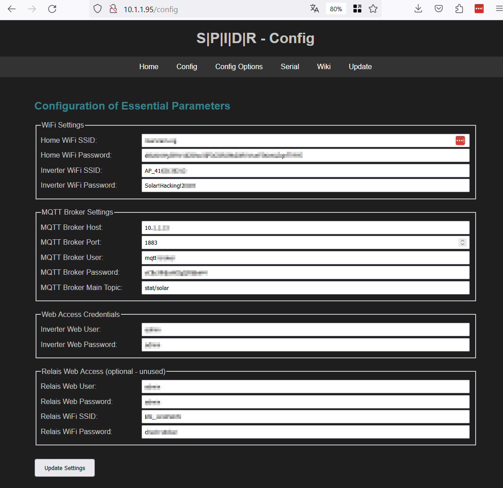

> [!NOTE]
> Further information about how to flash precompiled binaries will follow here once binaries are made available.

## Flashing binaries using the Tasmonizer
1. Download the Tasmonizer from the [Tasmonizer Tool Page](https://github.com/tasmota/tasmotizer)
2. Download the matching binary for your Board from the SPIDR [Binaries Folder](https://github.com/marxram/spidr/tree/main/binaries)
3. Flash it with Tasmonizer with the Option "Bin file" and select the SPIDR binary - Be carful with the **Erase before flash** option. This will override an existing  config. 
4. Click Tasmonize

5. Wait until the SPIDR Controller is giong into AP Mode.
6. Connect to the SPIDR Access point and visit the webpage (The IP is printed on screen)
7. Configure WiFi, Inverter Password and MQTT Setting
8. Reboot the SPIDR ESP --> It should now work 

