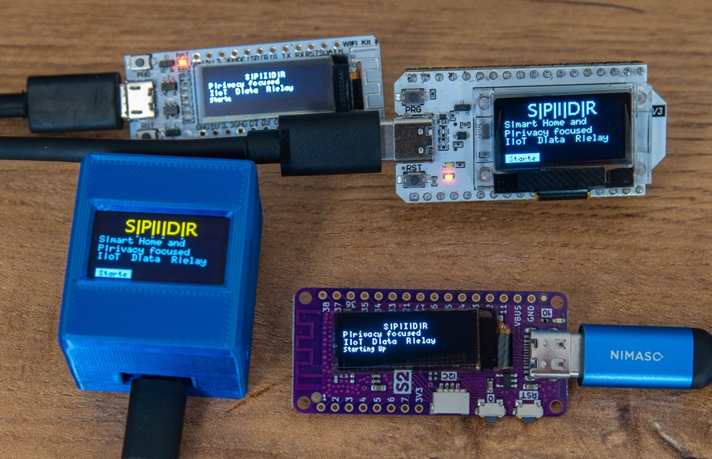

# Tested Boards

S|P|I|D|R is designed to be both cost-effective and energy-efficient. While I enjoy soldering and custom hardware builds, the focus on usability and mass compatibility has led me to also work with off-the-shelf modules that include displays.

The project currently supports both ESP8266 and ESP32 boards, specifically using OLED displays with resolutions of 128x32 or 128x64. Several boards with integrated displays have been thoroughly tested and have had specific adjustments and defines created for them.

> [!NOTE]
> Due to the fact that ESP32 directly supports FreeRTOS and Multithreading, Maybe support for ESP8266 will be droped for further development.
> Multithreading is essential for the Webserver to be responsive.




## Heltec Wifi Kit 32 v3 ESP32 (128x64) 


### Settings in config.h

```
#define SCREEN_WIDTH 128 // OLED display width, in pixels
#define SCREEN_HEIGHT 64 // OLED display height, in pixels
#define OLED_RESET     -1 // Reset pin # (or -1 if sharing Arduino reset pin)

///////////////////////////////////////////////////////////////////////
// HARDWARE SPECIFIC ADAPTIONS 
// Board Settings (I2C and Pins) -------------------------------------
// You don't need to do something here, if the board uses the normal I2C pins!

//#define BOARD_WEMOS_OLED_128x64_ESP32
//#define BOARD_HELTEC_OLED_128x32_ESP8266
#define BOARD_HELTEC_WiFiKit_32_V3_OLED_128x32_ESP32
//#define BOARD_WEMOS_OLED_128x32_ESP32_S2
//#define BOARD_ESP8266_OLED_Black_128x64_SDA_D1__SDC_D2
```

### Arduino IDE Board Setting
Select the board called "Heltec WiFi LoRa 32(V3) / Wireless shell(V3) /..."


### Modding and Cases

You can find my case including it's Fusion360 Source Code in printables: [3D printable cases on printables](https://www.printables.com/model/862028-spidr-branded-heltec-wifi-kit-v3-case-with-battery)


### Wemos Lolin S2 Pico ESP32-S2 (128x32)


### Settings in config.h

```
#define SCREEN_WIDTH 128 // OLED display width, in pixels
#define SCREEN_HEIGHT 32 // OLED display height, in pixels
#define OLED_RESET     -1 // Reset pin # (or -1 if sharing Arduino reset pin)

///////////////////////////////////////////////////////////////////////
// HARDWARE SPECIFIC ADAPTIONS 
// Board Settings (I2C and Pins) -------------------------------------
// You don't need to do something here, if the board uses the normal I2C pins!

//#define BOARD_WEMOS_OLED_128x64_ESP32
//#define BOARD_HELTEC_OLED_128x32_ESP8266
//#define BOARD_HELTEC_WiFiKit_32_V3_OLED_128x32_ESP32
#define BOARD_WEMOS_OLED_128x32_ESP32_S2
//#define BOARD_ESP8266_OLED_Black_128x64_SDA_D1__SDC_D2
```

### Arduino IDE Board Setting
Select the board called **WEMOS LOLINS2 Pico**


### Wemos ESP32 OLED baord(128x64)


### Settings in config.h

```
#define SCREEN_WIDTH 128 // OLED display width, in pixels
#define SCREEN_HEIGHT 64 // OLED display height, in pixels
#define OLED_RESET     -1 // Reset pin # (or -1 if sharing Arduino reset pin)

///////////////////////////////////////////////////////////////////////
// HARDWARE SPECIFIC ADAPTIONS 
// Board Settings (I2C and Pins) -------------------------------------
// You don't need to do something here, if the board uses the normal I2C pins!

#define BOARD_WEMOS_OLED_128x64_ESP32
//#define BOARD_HELTEC_OLED_128x32_ESP8266
//#define BOARD_HELTEC_WiFiKit_32_V3_OLED_128x32_ESP32
//#define BOARD_WEMOS_OLED_128x32_ESP32_S2
//#define BOARD_ESP8266_OLED_Black_128x64_SDA_D1__SDC_D2
```

### Arduino IDE Board Setting
Select the board called **WEMOS LOLIN 32**


### NodeMCU ESP8266 OLED HW-630 (128x64)

> [!NOTE]
> ESP8266 based boards are currently not supported due to compatibility and performance issues with the newest software! Consider using ESP32 based systems!


### Settings in config.h

```
#define SCREEN_WIDTH 128 // OLED display width, in pixels
#define SCREEN_HEIGHT 64 // OLED display height, in pixels
#define OLED_RESET     -1 // Reset pin # (or -1 if sharing Arduino reset pin)

///////////////////////////////////////////////////////////////////////
// HARDWARE SPECIFIC ADAPTIONS 
// Board Settings (I2C and Pins) -------------------------------------
// You don't need to do something here, if the board uses the normal I2C pins!

//#define BOARD_WEMOS_OLED_128x64_ESP32
//#define BOARD_HELTEC_OLED_128x32_ESP8266
//#define BOARD_HELTEC_WiFiKit_32_V3_OLED_128x32_ESP32
//#define BOARD_WEMOS_OLED_128x32_ESP32_S2
#define BOARD_ESP8266_OLED_Black_128x64_SDA_D1__SDC_D2
```

### Arduino IDE Board Setting
Select the board called **TBD**


### Heltec - WiFi Kit 8 - ESP8266 (128x32)

> [!NOTE]
> ESP8266 based boards are currently not supported due to compatibility and performance issues with the newest software! Consider using ESP32 based systems!


### Settings in config.h

```
#define SCREEN_WIDTH 128 // OLED display width, in pixels
#define SCREEN_HEIGHT 32 // OLED display height, in pixels
#define OLED_RESET     -1 // Reset pin # (or -1 if sharing Arduino reset pin)

///////////////////////////////////////////////////////////////////////
// HARDWARE SPECIFIC ADAPTIONS 
// Board Settings (I2C and Pins) -------------------------------------
// You don't need to do something here, if the board uses the normal I2C pins!

//#define BOARD_WEMOS_OLED_128x64_ESP32
#define BOARD_HELTEC_OLED_128x32_ESP8266
//#define BOARD_HELTEC_WiFiKit_32_V3_OLED_128x32_ESP32
//#define BOARD_WEMOS_OLED_128x32_ESP32_S2
//#define BOARD_ESP8266_OLED_Black_128x64_SDA_D1__SDC_D2
```

### Arduino IDE Board Setting
Select the board called **WiFi Kit 8**


### Generic ESP8266 Node MCU with generic OLED Display (128x64)

> [!NOTE]
> ESP8266 based boards are currently not supported due to compatibility and performance issues with the newest software! Consider using ESP32 based systems!


### Settings in config.h

```
#define SCREEN_WIDTH 128 // OLED display width, in pixels
#define SCREEN_HEIGHT 64 // OLED display height, in pixels
#define OLED_RESET     -1 // Reset pin # (or -1 if sharing Arduino reset pin)

///////////////////////////////////////////////////////////////////////
// HARDWARE SPECIFIC ADAPTIONS 
// Board Settings (I2C and Pins) -------------------------------------
// You don't need to do something here, if the board uses the normal I2C pins!

//#define BOARD_WEMOS_OLED_128x64_ESP32
//#define BOARD_HELTEC_OLED_128x32_ESP8266
//#define BOARD_HELTEC_WiFiKit_32_V3_OLED_128x32_ESP32
//#define BOARD_WEMOS_OLED_128x32_ESP32_S2
//#define BOARD_ESP8266_OLED_Black_128x64_SDA_D1__SDC_D2
```

### Arduino IDE Board Setting
Select the board called **Node MCU 1.0 (ESP-12E module)**


