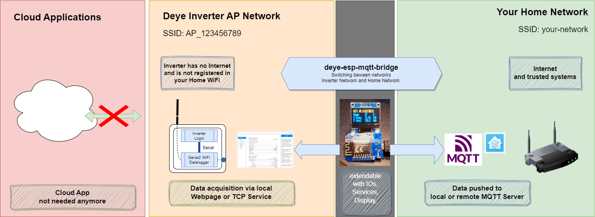
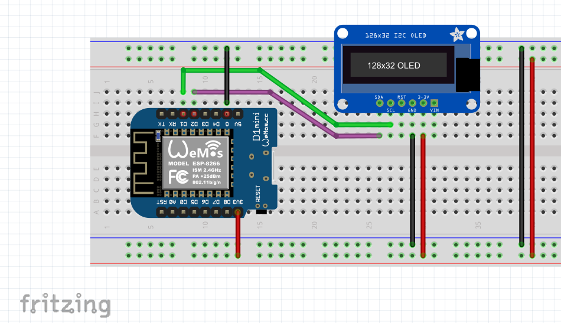
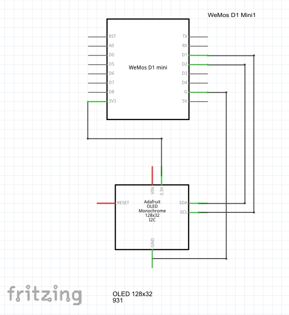

# Deye ESP WiFi Bridge📡

## Project Overview 🌟

The Deye ESP WiFi Bridge project aims to provide a simple and effective solution for bridging data between your solar-inverter and you smart home or 3rd party applications. The easy way would be to just deluver the data to a local mqtt broker as a well-known data inteface. 

This readme will guide you through the hardware and software requirements, as well as the steps to get started with this project.

### Motivation 🌍

The Deye solar inverters are known to communicate with the Solarman Cloud, which utilizes servers located in the US and China. However, for individuals and organizations in Europe 🇪🇺, there is a growing concern about data privacy and legal restrictions associated with transferring data outside of the European Union (EU). This project, "deye-esp-solar-bridge," has been developed to address these concerns and provide a solution for users in Europe.

### Workflow 🔄

The general workflow of the "deye-esp-solar-bridge" project is designed to give users control over their solar energy data while ensuring compliance with EU data protection regulations:

1. **Connect to the Solar Inverter**: The bridge device establishes a connection to the solar inverter, which creates its own WiFi access point.

2. **Retrieve Energy Data**: Once connected, the bridge reads crucial information such as energy harvesting and other relevant parameters from the solar inverter.

3. **Transition to Private Home Network**: After gathering the necessary data, the bridge securely disconnects from the solar inverter's network and seamlessly logs into your private home network.

4. **Data Transmission via MQTT (or Other Services)**: Within your private network, the collected data can be easily transmitted using the MQTT protocol or other services, ensuring that your energy data remains within the confines of your trusted network.

With this solution, the reliance on cloud-based connections to the Solarman Cloud is no longer needed, thereby safeguarding data privacy and adhering to EU regulations. 

### Goals 🚀

One of the primary goals of this project is to ensure user-friendliness and simplicity in setting up and using the Deye ESP Solar Bridge. The architecture has been designed with extensibility in mind, making it easy for users to adapt and expand the functionality to suit their specific needs.

As we continue to develop this project, future work will aim to enrich its features and capabilities. Your feedback and contributions are highly valued and encouraged as we strive to make this solution even more robust and versatile.

Thank you for joining us on this journey to empower individuals and organizations in Europe with greater control over their solar energy data.

## Getting Started 🚀

To get started with the Deye ESP WiFi Bridge, follow these steps:

### Hardware Requirements 🛠️

1. **ESP8266 or ESP32 Controller (Must Have)**: You will need either an ESP8266 or an ESP32 controller as the core of your WiFi bridge.

2. **I2C or SPI Display for Local Outputs and Debugging**:
   - Consider using an I2C or SPI display for local output and debugging purposes. This step is optional but highly recommended for a better development experience.

3. **Connection Diagram**:
   - Refer to the connection diagram (created with Fritzing) provided in the project repository to learn how to connect the ESP D1 Mini with an I2C display.

   
   

### Software Requirements 💻

1. **Arduino IDE**:
   - Ensure you have the Arduino IDE installed on your computer. You can download it from [here](https://www.arduino.cc/en/software).

2. **Required Libraries**:
   - Install the necessary libraries for your ESP controller and display. You can find these libraries in the project's repository or refer to the project documentation for specific library requirements.

3. **Local MQTT Broker**:
   - Create local MQTT broker and a technical user an account. Also external MQTT brokers are possible.

## Configuration 🛠️

4. Duplicate the "arduino_secrets-template.h" file provided in the project and rename it to "arduino_secrets.h."

5. In the "arduino_secrets.h" file, update the following configurations:

   - **WiFi Credentials**: Change the SSID and password to match your solar inverter's network and home network.

   - **MQTT Broker**: Configure the MQTT broker details, including the server address, port, and credentials.

   
6. Specific adaptions to the project 
   - **Display Settings**: Adjust settings such as I2C address, pixel size, or any other display-specific configuration as needed.

## Build and Flash 🚀

7. Open the Arduino IDE and load the project's main sketch.

8. Go to "Tools" > "Board" and select the correct board (ESP8266 or ESP32) that matches your hardware.

9. Compile the code by clicking the checkmark icon or selecting "Sketch" > "Verify/Compile."

10. Once the compilation is successful, connect your ESP board to your computer.

11. Go to "Tools" > "Port" and select the COM port to which your ESP board is connected.

12. Upload the binary to your ESP board by clicking the arrow icon or selecting "Sketch" > "Upload."

13. Monitor the Serial log output in the Arduino IDE for information and debugging. You can access the Serial Monitor by clicking "Tools" > "Serial Monitor."

## Roadmap 🗺️

The project's roadmap includes the following planned features and improvements:

- **Local Configuration Webpage**: Develop a local webpage that allows users to configure settings directly from the browser, simplifying setup.

- **Flashing via Browser USB-Serial**: Make installation easier, by flashing an image in the browser.

- **Reset Daily Energy Production Counter**: Implement functionality to reset the daily energy production counter, especially if the inverter lacks synchronization with the Solarman Cloud.

- **Automatic Solar-Inverter Configuration**: Automate the initial configuration of the Solar-Inverter to reduce manual setup requirements.

- **TCP Connection for Modbus**: Add a feature to establish a TCP connection to send and receive Modbus commands via port 48899, facilitating communication with external devices.

- **Firmware Update Feature**: Create a feature that enables users to update the firmware by downloading it from a trusted source like "https://github.com/dasrecht/deye-firmware" and installing it via the solar inverter website.

These enhancements aim to improve the functionality and usability of the Deye ESP WiFi Bridge project.

## Related GitHub Projects 🌐

Here are some related projects on GitHub that you might find interesting or helpful:

- [Deye-Firmware](https://github.com/dasrecht/deye-firmware): Many official firmware files are stored here so you can do updates locally via the Webfrontend of the inverter

- [Deye Logger AT CMD](https://github.com/s10l/deye-logger-at-cmd/tree/main):  This tool reads settings for WLAN (incl. connected SSID and WPA key) as well as web login credentials from the logger.

- [Deye Inverter Cloudfree](https://github.com/Hypfer/deye-microinverter-cloud-free): Mocking Server that can mock the Solarman Cloud to retrieve the data.

Feel free to explore these projects to enhance your experience with the Deye ESP WiFi Bridge or discover additional tools and resources in the IoT and home automation ecosystem.

If you have a related project and would like it to be featured here, please reach out and let us know!

© 2023 [deye-esp-mqtt-bridge]

