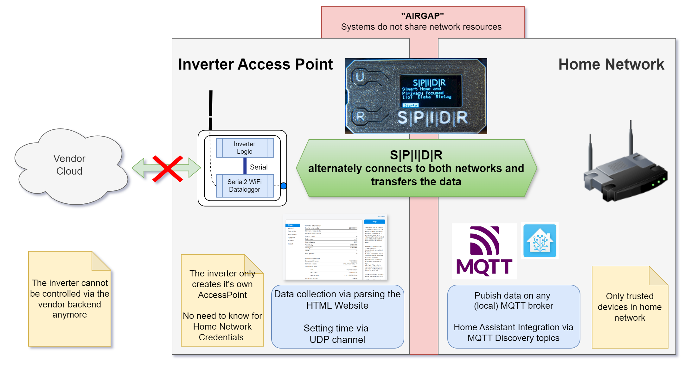
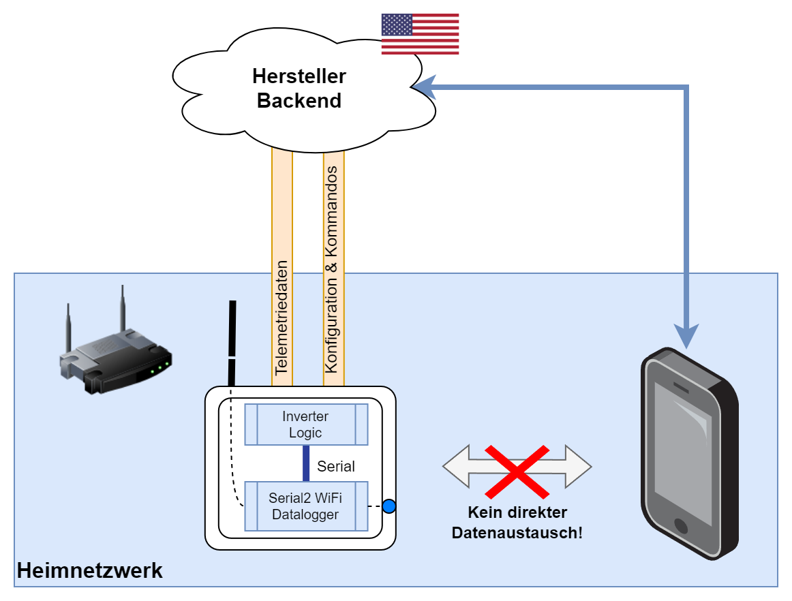
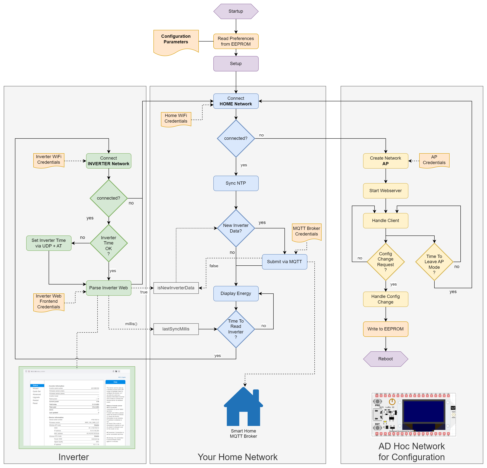
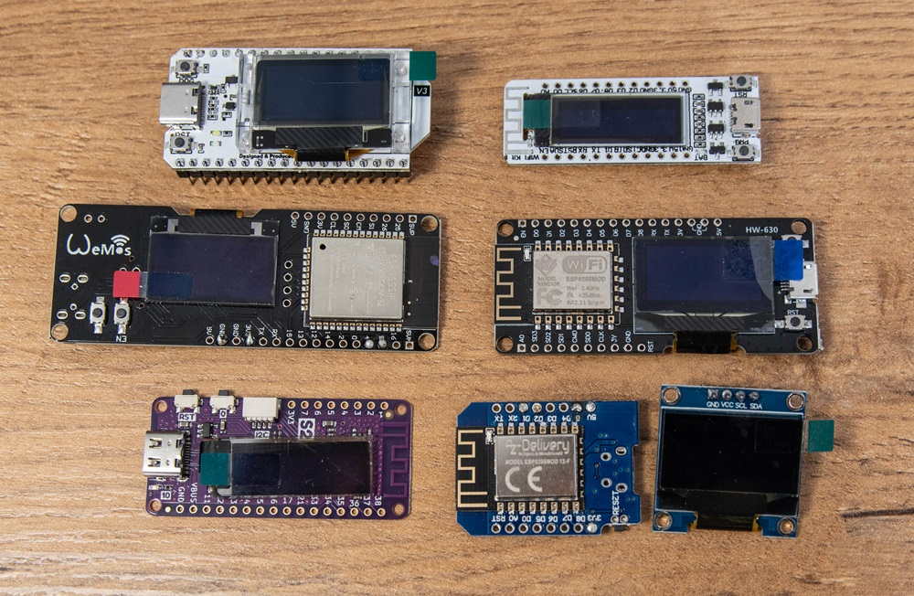
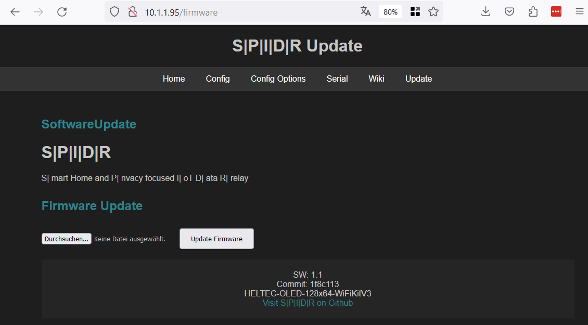

# S|P|I|D|R Project📡


## Project Overview 🌟

The S|P|I|D|R Project project aims to provide a simple and effective solution for bridging data between your solar-inverter and you smart home or 3rd party applications. The easy way would be to just deliver the data to a local mqtt broker as a well-known data inteface. 

This readme will guide you through the hardware and software requirements, as well as the steps to get started with this project.




### Motivation 🌍

The Deye solar inverters are known to communicate with the Solarman Cloud, which utilizes servers located in the US and China (also Europe since 2024). However, for individuals and organizations in Europe 🇪🇺, there is a growing concern about data privacy and legal restrictions associated with transferring data outside of the European Union (EU). This project, "S|P|I|D|R," has been developed to address these concerns and provide a solution for users in Europe.




### Workflow 🔄

The general workflow of the S|P|I|D|R project is designed to give users control over their solar energy data while ensuring compliance with EU data protection regulations:

1. **Connect to the Solar Inverter**: The bridge device establishes a connection to the solar inverter, which creates its own WiFi access point.

2. **Retrieve Energy Data**: Once connected, the bridge reads crucial information such as energy harvesting and other relevant parameters from the solar inverter.

3. **Connect to Private Home Network**: After gathering the necessary data, the bridge securely disconnects from the solar inverter's network and seamlessly logs into your private home network.

4. **Data Transmission via MQTT (or Other Services)**: Within your private network, the collected data can be easily transmitted using the MQTT protocol or other services, ensuring that your energy data remains within the confines of your trusted network.

5. **Home Assistant integration**: Using auto discovery topics to describe the Inverter data, it will be directly found on your Home Assistant instance, if it is connected to the same MQTT broker.  

With this solution, the reliance on cloud-based connections to the Solarman Cloud is no longer needed, thereby safeguarding data privacy and adhering to EU regulations. 




> [!NOTE]
> For a detailed code explanation you can checkout the [Code Components Documentation Page](./Documentation_CodeComponents.md)   


## Key Features

- **Usability**: Designed to be accessible and usable by everyone, ensuring a user-friendly experience.
- **Stand Alone**: Functions as a display and data logger independently of MQTT, offering flexibility in deployment.
- **Secure**: Employs airgapping to prevent the inverter from directly connecting to the home network, enhancing security.
- **Data Relay**: Efficiently collects data from the inverter and transmits it to an MQTT broker for further processing.
- **Integration**: Seamlessly integrates with various smart home systems, including but not limited to Home Assistant.
- **Modularity and Expandability**: The system is built to be modular, supporting additional devices and functionalities, enabling users to customize to their needs.
- **SOTA (Software Over The Air)**: Updates are simplified to ensure ease of implementation for users, maintaining the system with minimal effort.


### Goals 🚀

One of the primary goals of this project is to ensure user-friendliness and simplicity in setting up and using the Deye ESP Solar Bridge. The architecture has been designed with extensibility in mind, making it easy for users to adapt and expand the functionality to suit their specific needs.

As we continue to develop this project, future work will aim to enrich its features and capabilities. Your feedback and contributions are highly valued and encouraged as we strive to make this solution even more robust and versatile.

Thank you for joining us on this journey to empower individuals and organizations in Europe with greater control over their solar energy data.


## Getting Started 🚀

### Compiling Option 
Check out the [Getting Started Compilation Page](./GettingStarted_Compilation.md) that explains all dependencies and explains how to build code for different boards.

### Precompiled Binaries
[ ] ToDo Flas Binaries Documentation and Deliver Binaries
The [Getting Started Precompiled Binaries Page](./GettingStarted_FlashBinaries.md) will soon explain how to use SPIDR without the need to compile and install Arduino IDE. This option will only be available for certain chosen boards. 

### Supported Hardware 🛠️

S|P|I|D|R is designed to be both cost-effective and energy-efficient. While I enjoy soldering and custom hardware builds, the focus on usability and mass compatibility has led me to also work with off-the-shelf modules that include displays.

The project currently supports both ESP8266 and ESP32 boards, specifically using OLED displays with resolutions of 128x32 or 128x64. Several boards with integrated displays have been thoroughly tested and have had specific adjustments and defines created for them. Details are described on the [Getting Started Compilation Page](./GettingStarted_Compilation.md)

- **Heltec Wifi Kit 32 v3 ESP32** (128x64) [3D printable cases on printables](https://www.printables.com/model/862028-spidr-branded-heltec-wifi-kit-v3-case-with-battery)
- **Wemos Lolin S2 Pico ESP32-S2** (128x32)
- **Wemos Lolin32 ESP32 OLED** (128x64)
- **NodeMCU ESP8266 OLED HW-630** (128x64)
- **Heltec ESP8266 NodeMCU** (128x32)




## Webserver and Configuration

The major configuration Settings are the WiFi and Webserver Credentials for the Inverter and the MQTT Broker


 ```cpp
// Content of the default arduino-secrets-template.h File
// This can be copied and renamed to arduino-secrets.h to set the configurations during compile time
// All these values can also later be overwritten from the Webserver Configuration

#define SECRET_WIFI_HOME_SSID "YOUR-HOME-WIFI"
#define  SECRET_WIFI_HOME_KEY "YOUR-WIFI-PASSKEY"

#define  SECRET_WIFI_INVERTER_SSID "AP_12345678"
#define  SECRET_WIFI_INVERTER_KEY "12345678"

#define  SECRET_WIFI_RELAIS_SSID "EM_12345678"
#define  SECRET_WIFI_RELAIS_KEY "check-sticker"

#define  SECRET_MQTT_BROKER_HOST "BROKER-IP-or-Hostname"
#define  SECRET_MQTT_BROKER_PORT 1883
#define  SECRET_MQTT_BROKER_USER "Client-USER"
#define  SECRET_MQTT_BROKER_PWD "Client-PWD"
#define  SECRET_MQTT_BROKER_MAINTOPIC "stats/energy/deye/"

#define  SECRET_INVERTER_WEBACCESS_USER "admin"
#define  SECRET_INVERTER_WEBACCESS_PWD "admin"
```

## Updating the Software on a running instance
There is a SOTA Feature that can update the programm easily via the Webbrowser. 

> [!NOTE]
> This was not tested with all boards yet. 

> [!NOTE]
> If you just flash a new version of SPIDR on your ESP, the parameters should prevail in the EEPROM / Filesystem. 




## Roadmap 🗺️

The project's roadmap includes the following planned features and improvements:

- [x] **Local Configuration Webpage**: Develop a local webpage that allows users to configure settings directly from the browser, simplifying setup.

- [x] **Flashing via Browser USB-Serial**: Make installation easier, by flashing an image in the browser. Currently only SOTA, if aleady flashed once.

- [x] **Reset Daily Energy Production Counter**: Implement functionality to reset the daily energy production counter, especially if the inverter lacks synchronization with the Solarman Cloud.

- [x] **TCP Connection for Modbus**: Add a feature to establish a TCP connection to send and receive Modbus commands via port 48899, facilitating communication with external devices.

- [ ] **Inverter Firmware Update Feature**: Create a feature that enables users to update the firmware by downloading it from a trusted source like "https://github.com/dasrecht/deye-firmware" and installing it via the solar inverter website.

These enhancements aim to improve the functionality and usability of the S|P|I|D|R Project project.

## Related GitHub Projects 🌐

Here are some related projects on GitHub that you might find interesting or helpful:

- [Deye-Firmware](https://github.com/dasrecht/deye-firmware): Many official firmware files are stored here so you can do updates locally via the Webfrontend of the inverter

- [Deye Logger AT CMD](https://github.com/s10l/deye-logger-at-cmd/tree/main):  This tool reads settings for WLAN (incl. connected SSID and WPA key) as well as web login credentials from the logger.

- [Deye Inverter Cloudfree](https://github.com/Hypfer/deye-microinverter-cloud-free): Mocking Server that can mock the Solarman Cloud to retrieve the data.

Feel free to explore these projects to enhance your experience with the S|P|I|D|R Project or discover additional tools and resources in the IoT and home automation ecosystem.

If you have a related project and would like it to be featured here, please reach out and let us know!

© 2023 [spidr]

